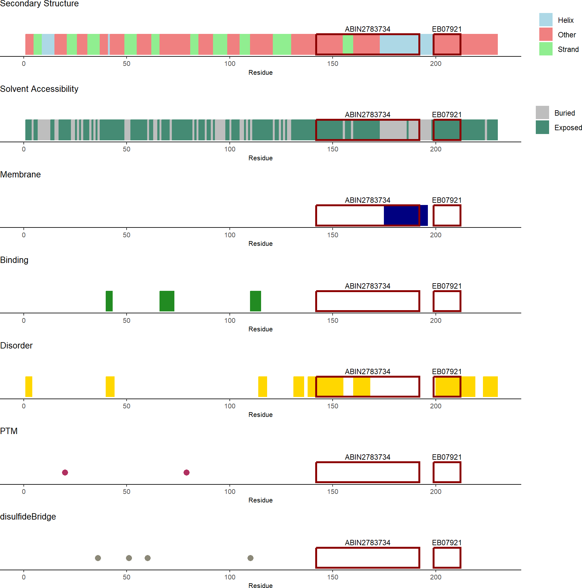
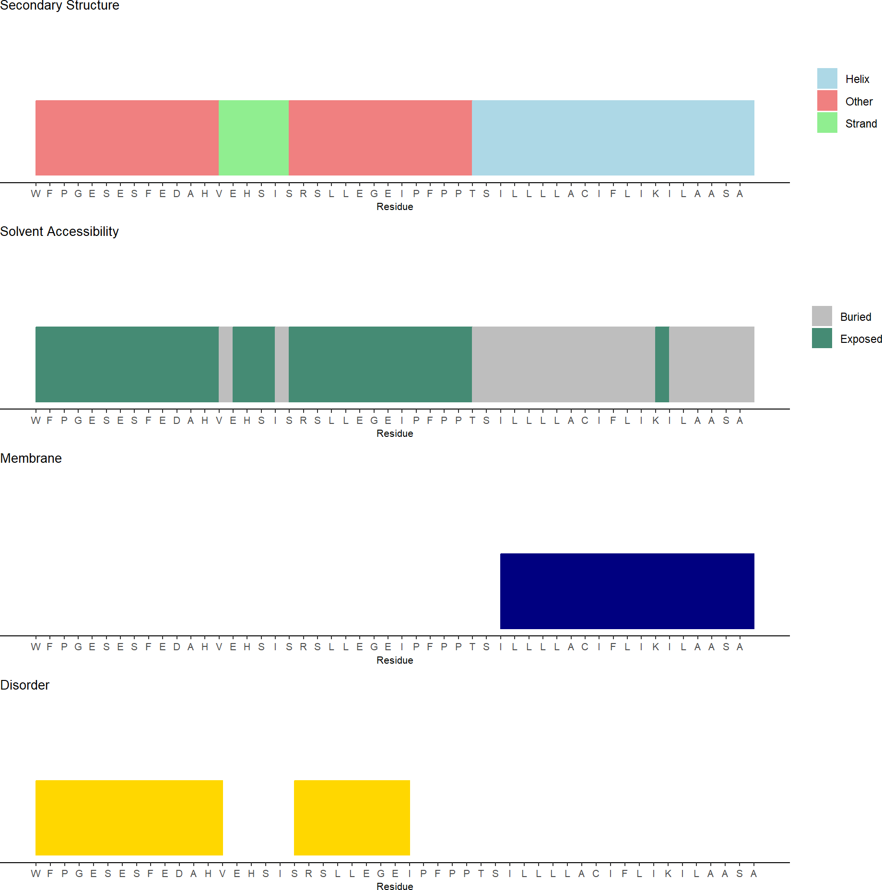

# immunogenViewer

The package `immunogenViewer` is meant to support researchers in comparing and choosing suitable antibodies provided that information on the immunogen used to raise the antibody is available. When the immunogen of an antibody is known, its binding site within the protein antigen is defined and can be examined in detail. As antibodies raised against peptide immunogens often do not function properly when used to detect natively folded proteins [Brown et al. 2011](http://www.doi.org/10.1371/journal.pone.0028718), examination of the position of the immunogen within the full-length protein can provide insights. Using `immunogenViewer` provides an easy approach to visualize, evaluate and compare immunogens within the full-length sequence of a protein. Information on structural and functional annotations of the immunogen and thus antibody binding site can tell the user if an antibody is potentially useful for native protein detection ([Trier et al. 2012](http://www.doi.org/10.1016/j.ymeth.2011.12.001). [Waury et al. 2022](http://www.doi.org/10.1186/s40364-022-00425-w)).

Specifically, `immunogenViewer` can be used to retrieve protein features for a protein of interest using an API call to the [UniProtKB](https://www.uniprot.org/) and [PredictProtein](https://predictprotein.org/) databases. The features are saved on a per-residue level in a dataframe. One or several immunogens can be associated with the protein. The immunogen(s) can then be visualized and evaluated regarding their structure and other annotations that can influence successful antibody recognition within the full-length protein. A summary report of the immunogen can be created to easily compare and select favorable immunogens and their respective antibodies. This package should be used as a pre-selection step to exclude unsuitable antibodies early on. It does not replace comprehensive antibody validation. For more information on validation, please refer to other excellent resources [Roncador et al. 2015](http://www.doi.org/10.1080/19420862.2015.1100787), [Voskuil et al. 2020](http://www.doi.org/10.1080/19420862.2020.1794421).


## Installation 

The package can currently be installed directly from GitHub.

```{r installation, eval=FALSE}
install.packages("devtools")
devtools::install_github("kathiwaury/immunogenViewer")
library(immunogenViewer)
```

## Package usage

The package can be used to retrieve relevant properties for a protein of interest which are saved in a protein dataframe. Immunogens can be added to the protein dataframe via position or sequence information.

```{r features, eval=FALSE}
protein <- getProteinFeatures("Q9NZC2")
protein <- addImmunogen(protein, start = 196, end = 230, name = "HPA010917")
protein <- addImmunogen(protein, seq = "HGQKPGTHPPSELD", name = "EB07921")
```
The full protein sequence with all properties and with the immunogens highlighted can be visualized. 
```{r protein, eval=FALSE}
plotProtein(protein)
```


Specific immunogens within the protein sequence can also be viewed.
```{r immunogen, eval=FALSE}
plotImmunogen(protein, "ABIN2783734")
```


For detailed use instructions, please see the vignette and manual.

## Contact and bug reports
If you encounter a bug or any issue, please open an issue [here](https://github.com/kathiwaury/immunogenViewer/issues). For any other questions or comments, please contact Katharina Waury ([k.waury@vu.nl](mailto:k.waury@vu.nl)).
